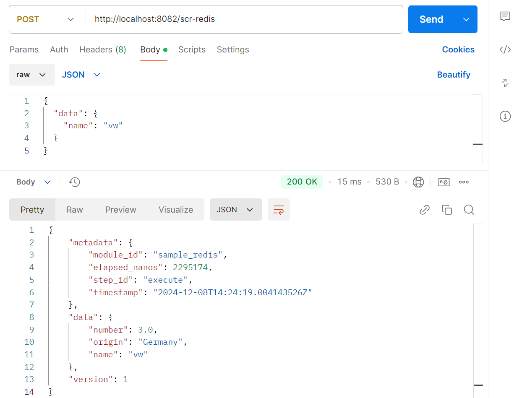
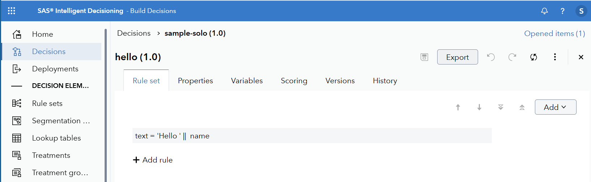
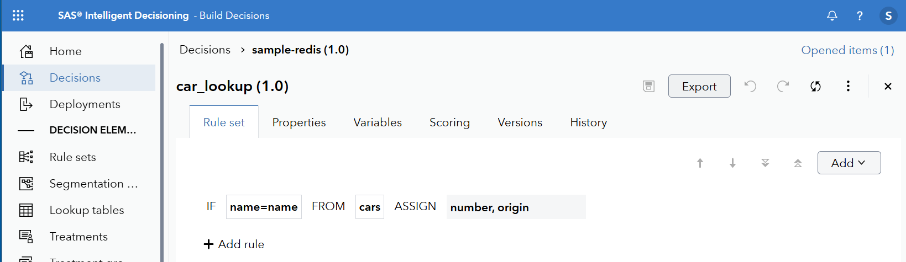
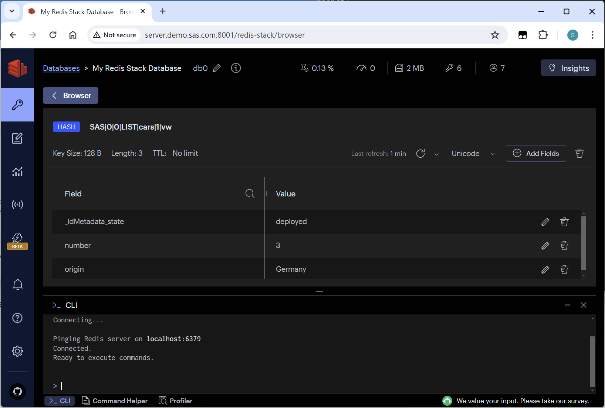
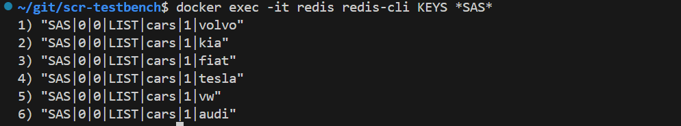
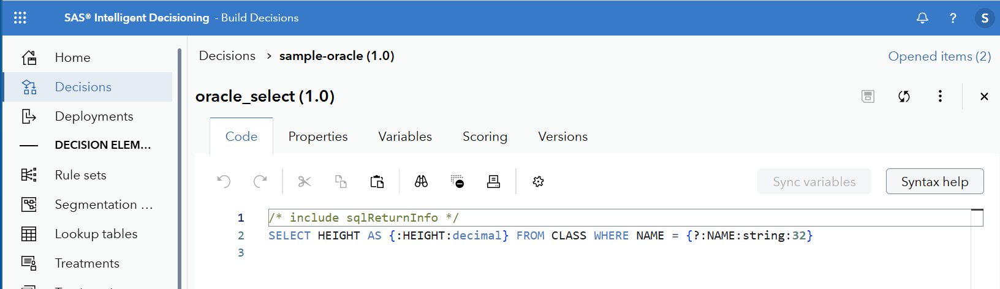
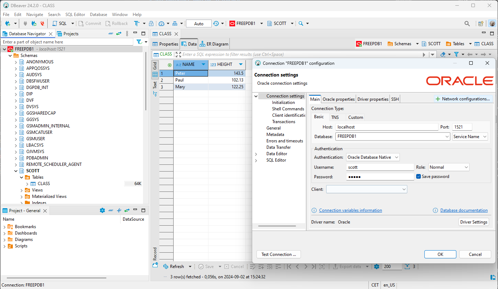
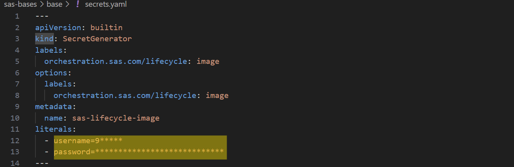
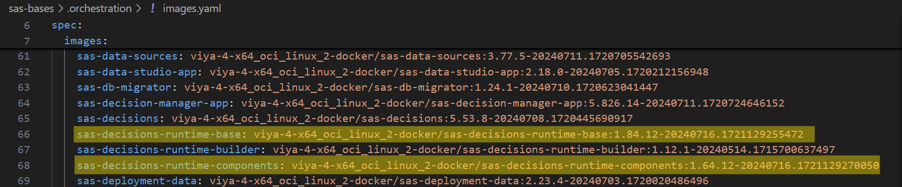

# SAS Container Runtime Testbench

## Overview

Boilerplate setup for testing SCR images. Works with Viya 4. Does not require a SAS Container Runtime publishing destination.

Three deployent variants are configured with Docker compose:

Deployment | Description | Decision endpoint 
--------|-------------|-------------------
[scr-solo](/scr-solo)     | Standalone SCR container  | http://*host-name*:8081/scr-solo
[scr-redis](/scr-redis)   | SCR and Redis supporting ID advanced lists | http://*host-name*:8082/scr-redis
[scr-oracle](/scr-oracle) | SCR bundled and Oracle | http://*host-name*:8083/scr-oracle

## Prerequisites

1. Viya 4 license with credentials for SAS container registry (cr.sas.com). See [About Viya 4 deployment assets](#about-viya-4-deployment-assets) for details.
2. Linux x86-64 installation, f.ex. a windows laptop using wsl2. May also work on Apple silicon Macs - but not tested.
3. Docker + docker compose, f.ex. [Docker Desktop](https://www.docker.com/products/docker-desktop/).

## Contributing
Maintainers are not currently accepting patches and contributions to this project.

## License
This project is licensed under the [Apache 2.0 License](LICENSE).

## Use of Oracle and Redis containers
Deploying the SAS Container Runtime by following these examples will install containers published by Oracle and Redis, which are governed by their own terms of use and license agreements:
 - [Oracle Free Use Terms and Conditions](https://www.oracle.com/downloads/licenses/oracle-free-license.html)
 - [Docker Hub Redis (license section at bottom of page)](https://hub.docker.com/_/redis)

# How-to steps

## 1. Authenticate Docker to SAS Container Registry
Log in to cr.sas.com with docker. Apply credentials from your Viya license (see [About Viya 4 deployment assets](#about-viya-4-deployment-assets)). 

Example:
```
$ docker login cr.sas.com
Username: 9ABC123
Password: **************
Login Succeeded
$ 
```

## 2. (Optional) Deploy decision from ID on Viya
In this step you'll pull SCR decision code from a Viya 4 decision flow. There is not need to publish the flow first. Its may be a good idea to validate.
Skip this step to apply one of the default sample decsionion flows containted in this repo.

### How-to deploy decision
- Change directory into deployment folder (scr-solo, src-oracle or scr-redis depending on use case)
- Run deployment script: `../deploy.py <decision URL>`. Specify decison URL as either
  - https://*viya-host*/decisions/flows/*decison-id* or
  - https://*viya-host*/SASDecisionManager/decisions/*decison-id*
- When needed, the deployment script prompts for a Viya authorization code.

Example:
```
~/git$ cd scr-testbench/scr-solo
~/git/scr-testbench/scr-solo$ ../deploy.py https://create.demo.sas.com/SASDecisionManager/decisions/a5d7ccd6-a561-4aa9-b105-3e8ca5ce6835
Open the following link in a web browser and sign in to obtain an authorization code
https://create.demo.sas.com/SASLogon/oauth/authorize?client_id=sas.cli&response_type=code
Code: B2h1GfXg6WsbLAmvFXVUaxhOH2goRaRA
Updated refresh_token for https://create.demo.sas.com in /home/sas/scr-testbench/.viyatokens
Connected to https://create.demo.sas.com as "******"
Wrote sample_solo code to /home/sas/scr-testbench/scr-solo/scr-app/content/code.ds2
Created /home/sas/scr-testbench/scr-solo/scr-app/content/_module_definition.json
~/scr-testbench/scr-solo$
```

## 3. Run Container(s)

`docker compose up -d` starts the container(s) .

Example:
```
~/scr-testbench/scr-solo$ docker compose up -d
[+] Running 2/2
 ✔ Network scr-solo_default  Created                                                                               0.0s
 ✔ Container scr-solo        Started                                                                               0.5s
~/scr-testbench/scr-solo$
```

## 4. Test decision endpoint using f.ex postman or curl
You can call the SCR decision endpoint using curl:

scr-solo:
```
$ curl -k http://localhost:8081/scr-solo --header 'Content-Type: application/json' --data '{"data": {"name": "world"}}'
{"metadata":{"module_id":"sample_solo","elapsed_nanos":834658,"step_id":"execute","timestamp":"2024-12-08T14:29:23.540531998Z"},"data":{"text":"Hello world"},"version":1}
```

scr-redis:
```
$ curl -k http://localhost:8082/scr-redis --header 'Content-Type: application/json' --data '{"data": {"name": "kia"}}'
{"metadata":{"module_id":"sample_redis","elapsed_nanos":3355305,"step_id":"execute","timestamp":"2024-12-08T14:30:29.350762937Z"},"data":{"number":2.0,"origin":"Korea","name":"kia"},"version":1}
```

scr-oracle:
```
$ curl -k http://localhost:8083/scr-oracle --header 'Content-Type: application/json' --data '{"data": {"name": "Paul"}}'
{"metadata":{"module_id":"sample_oracle","elapsed_nanos":3936668,"step_id":"execute","timestamp":"2024-12-08T14:34:49.068232085Z"},"data":{"returnCode":0.0,"rowCount":1.0,"HEIGHT":102.13,"NAME":"Paul"},"version":1}
```

Or use the included [postman collection](localhost.postman_collection.json). E.g.:





# Sample deployments

Each deployment in this repo comes with a sample SCR decision flows (see [sample-decisions](sample-decisions) for SAS packages exported with Viya Environment Manager).

To apply some other decision flow, see [How-to deploy decision](#how-to-deploy-decision).


## SCR solo
[scr-solo](scr-solo/docker-compose.yml) is a standalone SCR deployment. 

The decision *sample-solo* contains a singe RuleSet to create a basic 'Hello *name*' greeting:



## SCR deployed with Redis
The [scr-redis](scr-redis/docker-compose.yml) deployment bundles [Redis Stack Community Edition](https://redis.io/docs/latest/get-started/) with SAS Container Runtime. 

The decision *sample-redis* contains a singe RuleSet that does a lookup in the advanced list *cars*:





### Redis data
On startup, Redis loads the [Intelligent Decisioning advanced list](https://go.documentation.sas.com/doc/en/edmcdc/v_052/edmug/n0klymvgbidgcfn1ec48cudmsyj4.htm) *cars*:

| Name (key) | Number | Origin |
|------------|--------|--------|
| volvo      | 1      | Sweden |
| kia        | 2      | Korea  |
| vw         | 3      | Germany|

The startup script [load-data.sh](scr-redis/redis/load-data.sh) applies [redis-cli](https://redis.io/docs/latest/develop/connect/cli/) to load [cars.redis](scr-redis/redis/cars.redis):

```
HSET "SAS|0|0|LIST|cars|1|volvo" _ldMetadata_state "deployed" number "1" origin "Sweden"
HSET "SAS|0|0|LIST|cars|1|kia"   _ldMetadata_state "deployed" number "2" origin "Korea"
HSET "SAS|0|0|LIST|cars|1|vw"    _ldMetadata_state "deployed" number "3" origin "Germany"
```

### Manage Redis
Redis Stack provides a browser UI at http://*host-name*:8001/redis-stack/browser:




which allows for direct editing of data. The browser UI also provides a CLI.

You can also accees the CLI from a regular console through `docker exec -it redis redis-cli`:




## SCR deployed with Oracle 
The [scr-oracle](scr-oracle/docker-compose.yml) deployment bundles [Oracle Database Free](https://www.oracle.com/database/free/) with SAS Container Runtime. 

The decision *sample-oracle* contains one SQL code file with a basic DBMS lookup:



The deployment pulls the Oracle container *Lite* image from [container-registry.oracle.com](https://container-registry.oracle.com/ords/ocr/ba/database/free).

See [oracle/Dockerfile](scr-oracle/oracle/Dockerfile):
```Dockerfile
FROM container-registry.oracle.com/database/free:latest:23.6.0.0-lite
..
```

### Credentials and sample data
At build time, the Oracle container runs the scripts in [oracle/scripts/build](scr-oracle/oracle/scripts/build) to setup credentials and some sample data. See snippets below.

[01_create_user_scott.sql](scr-oracle/oracle/scripts/build/01_create_user_scott.sql):
```sql
CREATE USER scott IDENTIFIED BY tiger;
GRANT CONNECT, RESOURCE, DBA TO scott;
```

[02_create_sample_data.sql](scr-oracle/oracle/scripts/build/02_create_sample_data.sql):
```sql
CREATE TABLE class (
  name VARCHAR2(32 CHAR),
  height NUMBER
);

INSERT INTO class(name, height) VALUES('Peter', 143.5);
INSERT INTO class(name, height) VALUES('Paul', 102.13);
INSERT INTO class(name, height) VALUES('Mary', 122.25);
```

Add/modify scripts as needed to support your use case.

### Manage Oracle database
You can use a tool a tool like [DBeaver](https://dbeaver.io/download/) to manage content in Oracle (database: `FREEPDB1`, credentials: `scott`/`tiger`): 




# Using the Docker CLI

## View logs

Use `docker container logs <container name>` to view logs, e.g.

```
~/git/scr-testbench/scr-solo$ docker container logs scr-solo
2024-05-29 11:27:29.024  INFO --- [           main] com.sas.mas.solo.Application                 : SAS Decision Container Runtime version 1.85.25 starting...
2024-05-29T11:27:30,184 [00000005] DEBUG App.tk.MAS.Service     - Micro Analytic Service version information: , V.04.00M0P05132024, Mon May 13 19:24:11 EDT 2024, , , day/mva-vb24050, laxno, , .
2024-05-29T11:27:30,184 [00000006] DEBUG App.tk.MAS     - Specified garbage collection interval of 60000 seconds is above the maximum 3600 seconds.  Defaulting to 60 seconds.
2024-05-29T11:27:30,184 [00000007] DEBUG App.tk.MAS     - Specified grace period of 1 seconds is below the minimum 5 seconds.  Defaulting to 10 seconds.
2024-05-29T11:27:30,190 [00000000] DEBUG App.tk.MAS.DataGrid     - >> tksfDataGrid()
2024-05-29T11:27:30,190 [00000000] DEBUG App.tk.MAS.DataGrid     - << 0x7f469545c0e0=tksfDataGrid(status=0x0)
2024-05-29T11:27:30,190 [00000000] DEBUG App.tk.MAS.Service     - MAS flags: 0x20000
```

use `docker container logs <container name> -f` for live log steaming (similar to `tail -f`).

## Rebuild container(s) 
Following a change (e.g. depolying a new decision), you may want to rebuild images. To do this add the `--build` option to `docker compose up`:
```
~/git/scr-testbench/scr-solo$ docker compose up -d --build
[+] Building 1.8s (8/8) FINISHED                                                                         docker:default
 => [scr internal] load build definition from Dockerfile                                                           0.0s
 => => transferring dockerfile: 342B                                                                               0.0s
 => [scr internal] load metadata for cr.sas.com/viya-4-x64_oci_linux_2-docker/sas-decisions-runtime-base:1.80.25-  1.7s
 => [scr internal] load .dockerignore                                                                              0.0s
 => => transferring context: 2B                                                                                    0.0s
 => [scr 1/3] FROM cr.sas.com/viya-4-x64_oci_linux_2-docker/sas-decisions-runtime-base:1.80.25-20240514.171569537  0.0s
 => [scr internal] load build context                                                                              0.0s
 => => transferring context: 80B                                                                                   0.0s
 => CACHED [scr 2/3] RUN chown sas:sas /modules                                                                    0.0s
 => CACHED [scr 3/3] COPY --chown=sas:sas content/_module_definition.json /modules/                                0.0s
 => [scr] exporting to image                                                                                       0.0s
 => => exporting layers                                                                                            0.0s
 => => writing image sha256:4311a24fac1923509ffe4646899f4b4adebb5de791a829197545000fd6f723e2                       0.0s
 => => naming to docker.io/library/scr-solo-scr                                                                    0.0s
[+] Running 1/0
 ✔ Container scr-solo  Running                                                                                     0.0s
~/git/scr-testbench/scr-solo$
```

## List containers 
The command `docker container ls` lists availble containers
```
~/git/scr-testbench/scr-solo$ docker container ls
CONTAINER ID   IMAGE             COMMAND                  CREATED         STATUS          PORTS                                            NAMES
7cac9b4a286b   scr-solo-scr      "/usr/lib/jvm/jre/bi…"   5 minutes ago   Up 5 minutes    0.0.0.0:8081->8080/tcp                           scr-solo
ced755b5bb48   scr-redis-redis   "/opt/scripts/start.…"   12 hours ago    Up 39 seconds   0.0.0.0:6379->6379/tcp, 0.0.0.0:8001->8001/tcp   redis
4ed9a650df70   scr-redis-scr     "/usr/lib/jvm/jre/bi…"   12 hours ago    Up 39 seconds   0.0.0.0:8082->8080/tcp                           scr-redis
~/git/scr-testbench/scr-solo$
```

## Root access to containers and package installation
Use `docker exec -it -u root <container name> bash` to get a root access inside a container.

To install linux utilities on SCR images, use the `microdnf` package manager. Example:

```
~/git/scr-testbench/scr-solo$ docker exec -it -u root scr-solo bash
[root@7cac9b4a286b /]# ps
bash: ps: command not found
[root@7cac9b4a286b /]# microdnf install procps

Downloading metadata...
Downloading metadata...
Downloading metadata...
Package                                                                                                                                    Repository                                             Size
Installing:
 procps-ng-3.3.15-14.el8.x86_64                                                                                                            ubi-8-baseos-rpms                                  338.0 kB
Transaction Summary:
 Installing:        1 packages
 Reinstalling:      0 packages
 Upgrading:         0 packages
 Obsoleting:        0 packages
 Removing:          0 packages
 Downgrading:       0 packages
Downloading packages...
Running transaction test...
Installing: procps-ng;3.3.15-14.el8;x86_64;ubi-8-baseos-rpms
OpenJDK VM warning: the use of signal() and sigset() for signal chaining was deprecated in version 16.0 and will be removed in a future release. Use sigaction() instead.
/sbin/ldconfig: /lib64/libnuma.so.1 is not a symbolic link

Complete.
[root@7cac9b4a286b /]# ps -ef
UID        PID  PPID  C STIME TTY          TIME CMD
sas          1     0  2 07:19 ?        00:00:19 /usr/lib/jvm/jre/bin/java -Xrs -cp /opt/scr/viya/home/solo:/opt/scr/viya/home/solo/lib/* com.sas.mas.solo.Application -Djava.library.path=/opt/scr/viy
sas         40     1  0 07:19 ?        00:00:00 sasels  59 56 60 2 1174ed
root        85     0  0 07:29 pts/0    00:00:00 bash
root       100     1  0 07:30 pts/0    00:00:00 [gpgconf] <defunct>
root       102     1  0 07:30 pts/0    00:00:00 [gpgconf] <defunct>
[root@7cac9b4a286b /]# cd /modules/
[root@7cac9b4a286b modules]# ls -la
total 12
drwxr-xr-x 1 sas  sas  4096 May 28 19:36 .
drwxr-xr-x 1 root root 4096 May 29 07:19 ..
-rw-r--r-- 1 sas  sas  2636 May 28 19:35 _module_definition.json
[root@7cac9b4a286b modules]#
```

# About Viya 4 deployment assets
Your SAS Viya 4 license provides a set of Viya deployment assets (a TGZ file) that you can download from [My SAS](https://my.sas.com).

The cr.sas.com credentials are located in `/sas-bases/base/secrets.yaml` inside the Viya deployment assets (username = order number):



## SCR base image versions

The SCR `Dockerfile` defines which base container image versions to apply, e.g.:
```Dockerfile
FROM cr.sas.com/viya-4-x64_oci_linux_2-docker/sas-decisions-runtime-components:1.60.25-20240514.1715695392496 as base
FROM cr.sas.com/viya-4-x64_oci_linux_2-docker/sas-decisions-runtime-base:1.80.25-20240514.1715695377677
...
```

- `sas-decisions-runtime-base` is the "raw" SCR image
- `sas-decisions-runtime-components` contains additional runtime components, like Oracle and Redis client binaries.

To apply another image version, change the version tag in the relevant `Dockerfile`. 
You must supply the full version tag (e.g. `1.80.25-20240514.1715695377677`) as cr.sas.com does not support aliases like `latest` or `1.80`.

The latest avaliable container images for your Viya license are listed in `/sas-bases/.orchestration/images.yaml` inside the Viya deployment assets:


